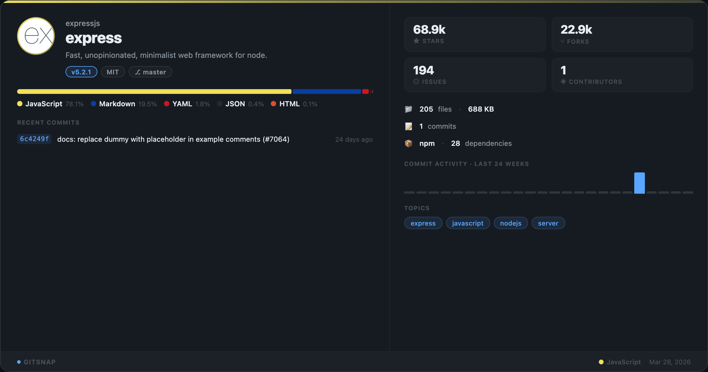
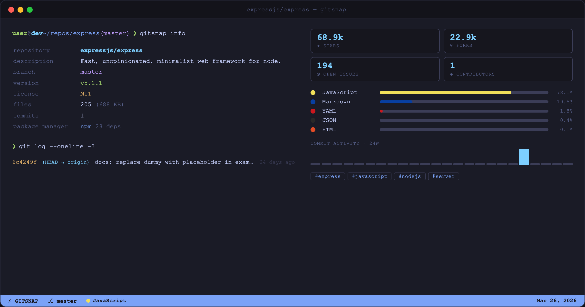

<div align="center">

# ⚡ gitsnap

**Generate beautiful visual snapshot cards of any git repository — in one command.**

[](https://github.com/MdAbdullahAlMahmud/gitsnap/actions/workflows/ci.yml)
[](https://www.npmjs.com/package/gitsnap)
[](https://www.npmjs.com/package/gitsnap)
[](LICENSE)
[](https://nodejs.org)

</div>

---

`gitsnap` turns any git repository into a shareable **1200×630 PNG card** — perfect for social media, README headers, release notes, or Discord/Slack previews. It automatically pulls language stats, GitHub metadata, recent commits, and more.

```bash
npx gitsnap
```

<div align="center">
  
  <br/><br/>
  
  <br/><br/>
  
</div>

---

## Features

- **Language breakdown** — colored bar with percentages, GitHub-style palette
- **GitHub stats** — stars, forks, open issues, contributors (auto-detected from remote)
- **Repo metadata** — file count, total size, commit count, repo age
- **Recent commits** — last 3 commits with short hash, message, and relative time
- **Activity sparkline** — 24-week commit frequency bar chart embedded in the card
- **Package info** — detected package manager + dependency count (npm, cargo, go modules, pip, pub)
- **Topics/tags** — GitHub topics displayed as chips
- **Two layouts** — `default` (modern card) and `terminal` (macOS window with shell aesthetic)
- **Two themes** — `dark` (default) and `light`
- **Three formats** — `png`, `pdf`, `svg`
- **`--open` flag** — auto-opens the generated image after saving
- **Zero config** — works on any git repo, no setup required
- **Offline mode** — `--no-github` skips API calls entirely

---

## Quick Start

```bash
# No install needed — run on current directory
npx gitsnap

# Snapshot a specific repo
npx gitsnap /path/to/my-project

# Light theme
npx gitsnap --theme light

# PDF output
npx gitsnap --format pdf

# Skip GitHub API (faster, works offline)
npx gitsnap --no-github

# Terminal layout (macOS window aesthetic)
npx gitsnap --layout terminal

# Open the image automatically after saving
npx gitsnap --open

# Custom output path
npx gitsnap --output ./cards/my-project
```

---

## Installation

```bash
# Global install
npm install -g gitsnap

# Or use without installing
npx gitsnap
```

**Requirements:** Node.js ≥ 18, git

---

## Options

| Flag | Default | Description |
|---|---|---|
| `[repo-path]` | `.` | Path to the git repository |
| `-f, --format <fmt>` | `png` | Output format: `png` · `pdf` · `svg` |
| `-o, --output <path>` | `gitsnap-output` | Output filename (no extension) |
| `-t, --theme <theme>` | `dark` | Card theme: `dark` · `light` |
| `-l, --layout <layout>` | `default` | Card layout: `default` · `terminal` |
| `--no-github` | — | Skip GitHub API calls |
| `--open` | — | Open generated image automatically |
| `--width <px>` | `1200` | Card width in pixels |
| `--height <px>` | `630` | Card height in pixels |
| `--token <token>` | — | GitHub personal access token |

---

## GitHub Authentication

For public repos, gitsnap works unauthenticated (60 req/hr). For higher limits or private repos:

```bash
# Recommended: environment variable
export GITHUB_TOKEN=ghp_xxxxxxxxxxxx
npx gitsnap

# Or pass directly
npx gitsnap --token ghp_xxxxxxxxxxxx
```

Token lookup order: `--token` flag → `GITHUB_TOKEN` env → `GH_TOKEN` env

---

## Card Layout

```
┌────────────────────────────────────────────────────────────┐
│  [Avatar]  owner / repo-name                       v1.2.3  │
│            A short description of the project              │
├────────────────────────────────────────────────────────────┤
│  ████████████████████░░░░░░░░  Language bar                │
│  TypeScript 62%  JavaScript 21%  CSS 12%  Other 5%         │
├────────────────────────────────────────────────────────────┤
│  ★ 1,234   ⑂ 234   ● 42 issues   👤 18 contributors      │
├────────────────────────────────────────────────────────────┤
│  📁 342 files  │  💾 14.2 MB  │  📝 1,847 commits          │
│  🕐 2 years ago  │  📦 npm · 47 deps                       │
├────────────────────────────────────────────────────────────┤
│  Recent: a1b2c3d  Fix auth middleware        (3h ago)      │
│          e4f5g6h  Add rate limiting          (yesterday)   │
│          d7e8f9i  Bump deps                  (3 days ago)  │
├────────────────────────────────────────────────────────────┤
│  topics:  react   typescript   api   open-source           │
└──────────────────── Generated by gitsnap ─────────────────┘
```

**Dark theme colors:** bg `#0d1117` · surface `#161b22` · accent `#58a6ff`
**Light theme colors:** bg `#ffffff` · surface `#f6f8fa` · accent `#0969da`

---

## Supported Package Managers / Languages

**Package detection:** npm · yarn · pnpm · bun · cargo · go modules · pip · poetry · pub (Flutter)

**Language colors:** TypeScript · JavaScript · Python · Rust · Go · Java · Kotlin · C/C++/C# · Ruby · PHP · Swift · Shell · Vue · Svelte · Dart · Elixir · Haskell · Lua · R · Julia · HCL · SQL · and more (~50 total)

---

## How It Works

```
npx gitsnap [repo-path]
       │
       ▼
 ┌─────────────────────────────────────────┐
 │  Promise.allSettled (parallel)          │
 │  ├── scanRepo()     ← git ls-files      │
 │  ├── parsePackages() ← manifest files   │
 │  └── fetchGithub()  ← octokit REST      │
 └─────────────────────────────────────────┘
       │
       ▼
  normalize() → RepoSnapshot
       │
       ▼
  renderCard() → Handlebars → HTML
       │
       ▼
  takeScreenshot() → Puppeteer → file
       │
       ▼
  ✓ Saved to gitsnap-output.png
```

Collectors run in parallel with `Promise.allSettled` — GitHub failures never block output.

---

## Development

```bash
git clone https://github.com/MdAbdullahAlMahmud/gitsnap
cd gitsnap
npm install

# Run CLI in dev mode
npx tsx src/cli.ts . --no-github

# Build
npm run build

# Test
npm test

# Test with coverage
npm run test:coverage

# Lint
npm run lint

# Format
npm run format
```

---

## Contributing

Contributions are very welcome! Please read [CONTRIBUTING.md](CONTRIBUTING.md) for guidelines.

- **Bug reports** → [GitHub Issues](https://github.com/MdAbdullahAlMahmud/gitsnap/issues)
- **Feature requests** → [GitHub Issues](https://github.com/MdAbdullahAlMahmud/gitsnap/issues)
- **Pull requests** → fork, branch, PR with a changeset

---

## License

[MIT](LICENSE) — free to use, modify, and distribute.

---

<div align="center">
Made with ❤️ — <a href="https://github.com/MdAbdullahAlMahmud/gitsnap">gitsnap</a>
</div>
